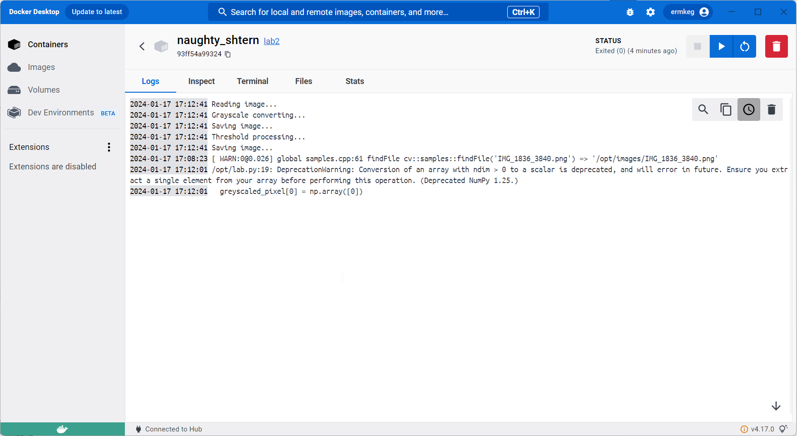
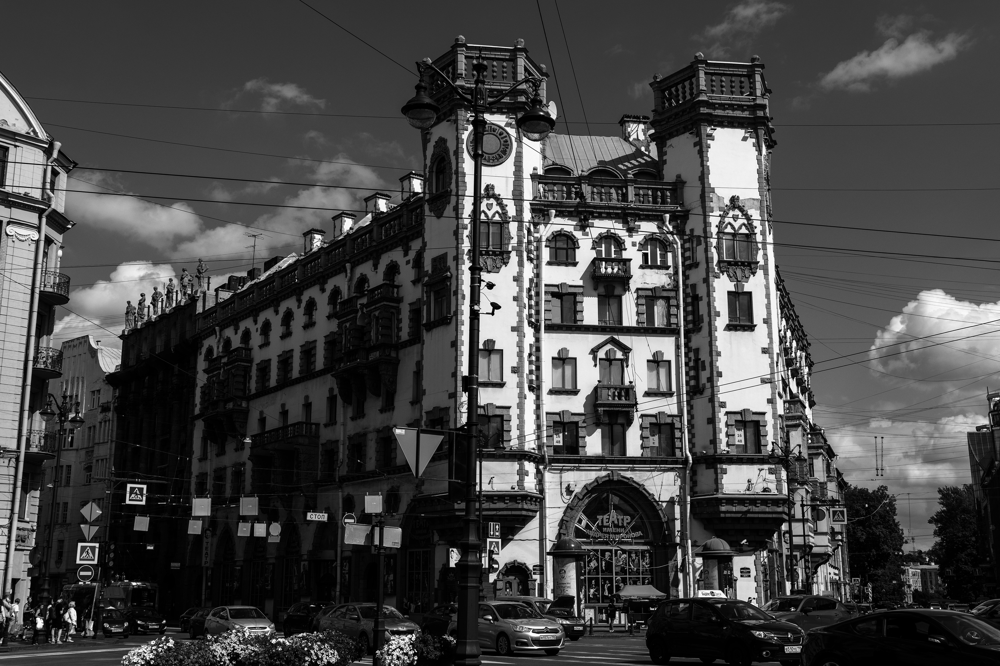
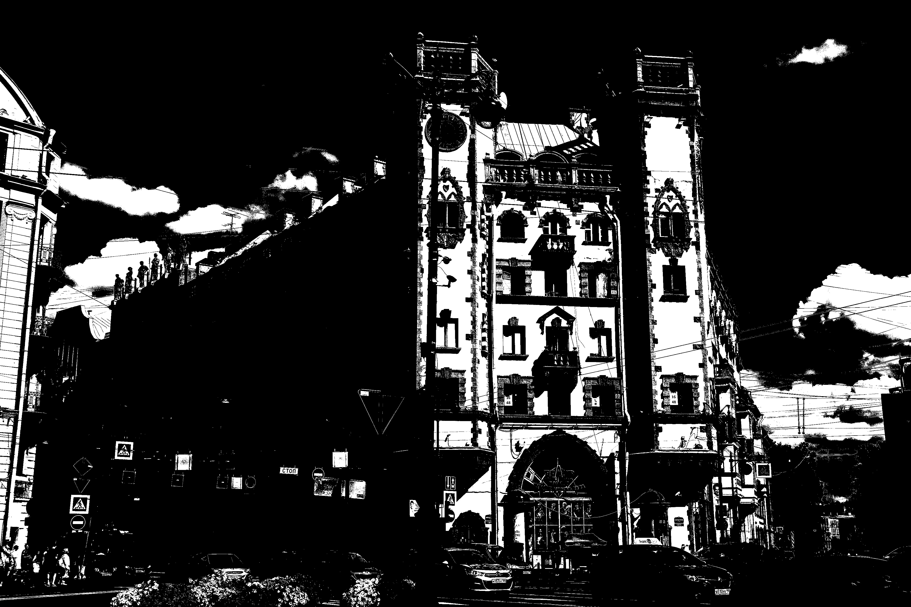
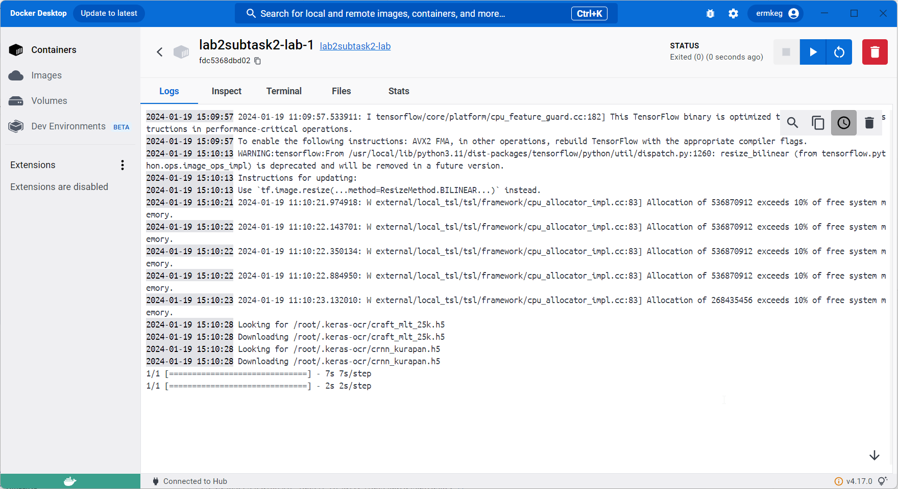
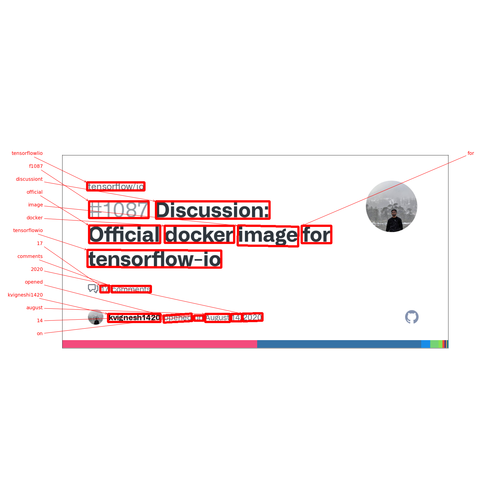

# Отчет по лабораторным работам
 
## Лабораторная 1

В данной лабораторной необходимо было написать реализацию однослойного перцептрона, в качестве датасета был выбран MNIST функция в качестве функции активации была использована Softmax. Лаборатроная выполенена в ipynb [блокноте](./lab1.ipynb).
Прямой проход реализован в методе 'forward_pass', расчет ошибки в методе 'loss', обратный проход 'backwards_pass', коррекция весов 'train_step', функция обучения с колличеством эпох 'train'. В качетве метрик была использована Accuracy и Confusion Matrix.

### Результаты по Accuracy
    - Ручная однослойная реализация: 0.8774
    - Sklearn однослойная реализация: 0.8879
    - Sklearn многослойная реализация: 0.9799

## Лабораторная 2
### Задача 1

В данной задаче был собран контенер в докере по предоставленому [файлу](./subtask1/Dockerfile), некторые инструкции были изменены поскольку работа была выполнена на Windows с помощью Docker Desktop. Тем не менее контейнер был собран и запущен,в нем выполнен этот [файл](./subtask1/lab.py):

В результате работы получены следующие изображения:
В качестве алгоритмов обрабоки была реализована гамма коррекция и конверсия изображения в серые тона:

А также пороговая обработка:

В [файле](./subtask1/lab.py) эти алгоритмы реализованны соответсвенно в функциях 'togreyscale' и 'threshold_proc'.

### Задача 2

В этой задаче был собран контейнер для обработки изображений с помощью нейросети. В качестве нейросети была использована библиотека keras-ocr для разметки текста на изображении. Контейнер был собран из образа tensorflow/tensorflow и запущен через docker compose:

В резульате работы было получено следующее изображение:

